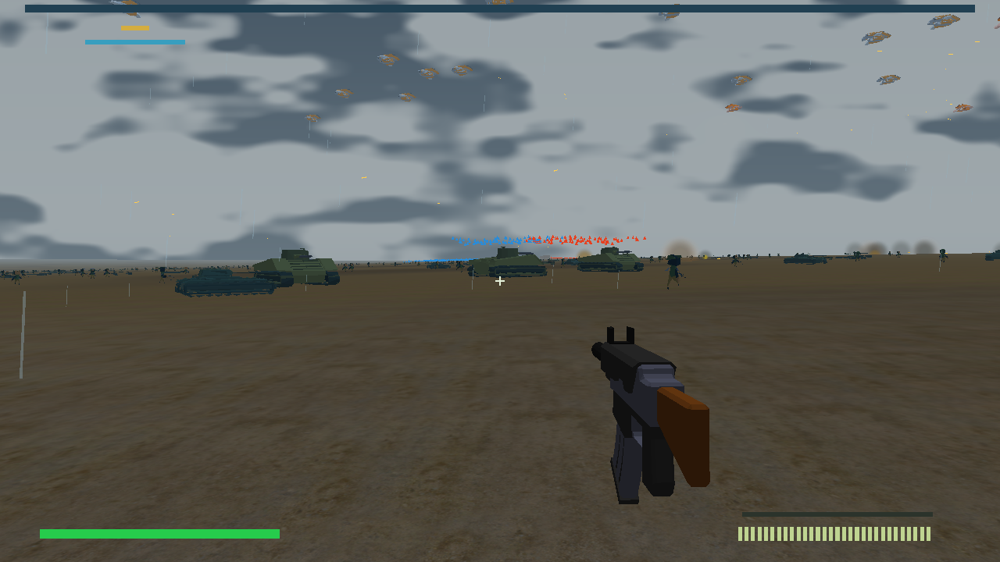

# RED HORIZON

**Command the offensive. Fight inside it.**

An assembly-first cooperative FPS/RTS under active development. The target is an 8 km battlefield with 4,096 real units on each side, three fronts, combined arms, command, logistics and recorded audio. This repository currently contains an early Linux prototype with terrain-aware army tactics, authoritative FPS combat and a shared-world co-op server. It is **not the completed game**.

All project-authored CPU runtime code is NASM x86-64 assembly; GPU code is GLSL. Python and shell are development tools only. Read [the canonical specification](docs/spec.txt), [current evidence and gaps](docs/status.md), and [ABI](docs/interfaces.md).



## Local development

Requires Linux x86-64, Python 3, GCC/linker, NASM 2.16.03, GLFW 3, OpenGL 4.5 and ALSA development/runtime libraries. The full test suite also requires Xvfb; it creates a private software-rendered display, so your desktop is not required. If NASM is absent, `bash tools/bootstrap-nasm.sh` downloads the pinned source, verifies its hash and builds under ignored `.tools/`.

```sh
python3 tools/dev.py doctor
python3 tools/dev.py build --changed
python3 tools/dev.py test --suite fast # routine iteration
python3 tools/dev.py test --suite player # focused module check
python3 tools/dev.py test --suite all --extended --background # integration checkpoint
python3 tools/dev.py bench --scenario scale-open --ticks 600
python3 tools/dev.py bench --scenario scale-stretch --ticks 600
python3 tools/dev.py bench --scenario scale-front --seed 42 --ticks 300
python3 tools/dev.py bench --scenario scale-hotspot --seed 42 --ticks 300
python3 tools/dev.py server --headless --ticks 300 --realtime
python3 tools/dev.py reload
python3 tools/dev.py build --target client
python3 tools/dev.py run --client
python3 tools/dev.py run --client --weather rain
python3 tools/dev.py run --client --width 1920 --height 1080 --fov 70 --sensitivity 0.002
python3 tools/dev.py run --client --scenario air-battle
python3 tools/dev.py run --client --scenario scale-hotspot
python3 tools/dev.py bench --client --scenario scale-hotspot --seed 42 --width 1920 --height 1080 --frames 600 --census
# Direct-IP/LAN hosting and joining (in separate terminals):
python3 tools/dev.py coop --port 7777
python3 tools/dev.py run --client --connect 127.0.0.1 --port 7777
```

AI aircraft now have finite sortie fuel: reserve fuel triggers withdrawal, and exhaustion causes a powerless glide with real terrain contact and engine-loop shutdown. Landing and refueling are still unfinished. [Fuel behavior and limits](docs/air-fuel.md) includes the verification scope. This update requires protocol41 peers; rebuild both host and clients.

The HDR battlefield now includes restrained bloom, short-lived impact lighting and nearby current-frame sunlight shadows from terrain and animated units. Shadows use a bounded caster budget; crowded/distant coverage and final art quality remain unfinished. See [shadow behavior and verified limits](docs/sun-shadows.md). On the reference development host, the original software-GL timed input checks pass with `LP_NUM_THREADS=16`; this setting controls llvmpipe test workers and is not a hardware frame-rate result.

Army infantry now carries finite rifle magazines and reserves, reloads over time, and stops firing when exhausted. [Ammunition behavior and remaining logistics work](docs/infantry-ammunition.md) explains the current limits.

Company identity, command acknowledgement, exchange offers and connection loss now render inside the game view. Retreat markers show the actual home destination; returning to advance preserves the accepted waypoint. Default F5–F8 requests an exchange, F9 accepts, F10 declines and F11 cancels. Narrow windows currently clip long status lines.

The `server` command runs the shared local headless simulation. `coop` hosts the actual shared-world UDP server; its default runs until interrupted, and `--ticks N` makes a finite test run. Throughput mode is default; `--realtime` schedules at 30 Hz. Scale-front and scale-hotspot launch concentrated encounters while retaining the full army. Headless metrics do not establish GPU frame rate or complete army intelligence.

Defend forms a spaced perimeter with artillery behind it; default5 uses the accepted waypoint, and the wheel’s upper-right sector selects crosshair terrain. See [defense behavior and limits](docs/company-defend.md).

Saved controls: copy [the default profile](content/bindings-default.cfg), edit it, and pass `--bindings FILE` (also supported by `tools/dev.py run --client`). All31 current actions accept a keyboard or mouse input; loaded command hints show the actual bindings. See [binding format and limitations](docs/input-bindings.md).

Default client controls: WASD, Shift sprint, Ctrl crouch, Space grounded jump, mouse aim/fire, R reload, E enter nearby allied armor, Q exit, Tab tactical view, F1/F2/F3 front selection, F4 clear/overcast/rain/fog, 1/2/3/4/5 advance/hold/retreat/follow/defend, hold middle mouse for the contextual command wheel, tactical click destination, F5–F8 request a company exchange with P0–P3, F9 accept the displayed offer, F10 decline, F11 cancel your offer, Escape cancels an open wheel or quits otherwise. Wheel MOVE uses the terrain under the crosshair; release sends one order, right click or the centre cancels. See [wheel controls and scope](docs/command-wheel.md). Health, suppression, death and safe redeployment are authoritative. At join, players 0–2 receive separate companies on fronts 0–2; player 3 receives another front 0 company. An explicitly accepted exchange swaps companies and command fronts without moving either player. Each formation keeps its orders; stale offers and old-front commands reject. See [company exchange controls and limitations](docs/company-transfer.md). Nearby actors use licensed source models with movement-driven authored soldier/tank animation; simplified source meshes and distant role/team markers preserve army visibility. The installed rifle, fortifications, trees and structures also use downloaded models. See [model pipeline and source limitations](docs/models.md). Photographed grass, mud, gravel and rocky terrain blend across the battlefield; cosmetic weather adds drifting clouds, rain, wet ground and distance fog. See [texture sources](docs/textures.md) and [weather controls](docs/environment-renderer.md). Recorded rifle/explosion/footstep PCM shares a128-voice stereo mixer with listener-relative panning and distance culling; a missing device is nonfatal. `RH_AUDIO_DEVICE=null` supports headless graphics smoke.

Tanks and self-propelled artillery share authoritative hull heading, acceleration,
braking and bounded turning. Drivers can reverse after braking through zero;
released input coasts to a stop. Cannon aim remains independent. Complete hull
segments retain terrain/body collision, and UDPv7 clients render the same heading
while moving or pivoting in place. See [ground motion](docs/ground-motion.md) and
[pose replication](docs/ground-presentation.md). Canonical roads match visible
materials and physical whole-hull contact. Off-road tanks/artillery accelerate
and travel at 0.8/0.7 of their paved targets, with bounded braking when leaving
pavement; see [surface outcomes](docs/ground-surface-outcomes.md) and
[current verification](docs/status.md). Raised terrain and whole-body slope admission are integrated with focused
proof and a passing full extended checkpoint. Tracked source hulls also follow
terrain pitch/roll with critically damped suspension and corrected intermediate
contact. Focused CPU/GL/client proof passes; current full checkpoint is recorded
in [status](docs/status.md). Oriented physical collision remains pending. See [terrain integration](docs/ground-terrain-next.md).
Road-preferring routes,
wheeled vehicles, articulated turrets and useful wreck cover remain open work.

`test --suite fast` checks small real-core combat/replay, operation, waypoints, terrain, tactics, players, reload, audio and asset integrity including default8k/16k motion checks and baked-model provenance. It omits large combat scale/replay, real UDP, graphics and build-tool isolation checks; full extended verification retains them. Focused core suites: operation, waypoints, terrain, player, tactics, combat, vehicles, ground-motion, ground-surfaces, effects. `build --target client --objects-only` validates assembly without linking or a GPU; it does not compile GLSL. Actual transitive NASM include/incbin dependencies control incremental rebuilds.

Slow checks can append `--background`. A job receives a frozen source copy, revision/hash, log and result path. Use `python3 tools/dev.py jobs` and `collect JOB_ID` to reconcile results. Build outputs and evidence remain under ignored `build/` and `runs/`.

## Development status

Linux scale combat, same-build replay, physical terrain/obstacle LOS and detours, observed-intelligence scouting/flank bounds/withdrawal, player vulnerability and recovery, authoritative UDP world replication, pooled moving tank/artillery shells, ground armor control, bounded tracer/impact effects, compatible module reload proof and a128-voice spatial recorded PCM mixer have tests. Windows, hierarchical navigation, full audiovisual production, human gameplay balance and complete operation acceptance remain pending. Network entity replication is capped to nearby records; it does not send the full army each snapshot. See the [full specification acceptance audit](docs/spec-acceptance.md), [task board](docs/task-board.md), [simulation](docs/simulation.md), [reload](docs/reload.md), and [audio](docs/audio.md), [terrain/tactics](docs/tactics.md), [players](docs/player.md), and [co-op protocol](docs/coop.md).

## Licences

Project code licence is pending owner approval. Public visibility does not grant reuse rights. Asset grants are separate; the recorded rifle sample is attributed under CC-BY-3.0 from its source archive, and the selected starter model packs and Poly Haven terrain textures have documented CC0 grants. See [credits](content/CREDITS.md), [manifest](content/asset-manifest.json), and [third-party notices](THIRD_PARTY.md).

Additional verified slices: twelve capture sites with supply connectivity and operation outcomes; formation waypoints; a standalone four-client UDP proof (`python3 tools/dev.py test --suite network`). The rifle has magazine/reload/recoil feedback. `python3 tools/dev.py package` builds a local Linux archive with checksums and credits; it does not publish a release. `run --client --frames 30 --screenshot /tmp/frame.ppm --tactical` provides a finite visual smoke.

Headless verification: `env -u DISPLAY -u WAYLAND_DISPLAY python3 tools/dev.py test --suite all` runs CPU, operation, reload, audio, UDP, build-tool and actual-client software graphics checks. `--suite headless` runs the CPU/audio/UDP/tooling checks without opening a graphics context (the texture-loader test links system OpenGL); `--suite graphics` checks the renderer alone using an isolated Xvfb display and llvmpipe. Test graphics are smoke evidence, not target GPU performance.

Dense front/hotspot fixtures retain all8,192 actors and concentrate mixed real forces before normal combat begins. See [physical layouts and measured engagement limits](docs/scenario-layout.md). They are local fixtures. Frame diagnostics distinguish submitted model counts from unmeasured pixel-visible actors; independent peak counts need not occur simultaneously.

Optional bounded `--census` captures actual depth-visible actor IDs and detail
classes in the final frame. `--census-map PATH.r32ui` saves its raw attachment for
independent decoding. Ordinary runs keep the existing rendering path. See
[pixel visibility scope and capture costs](docs/visibility-reporting.md).

Army infantry can replenish carried reserves from nearby eligible finite depots.
Transfers conserve rounds and retain reload timing; capture and route restoration
do not refill stores. Scope and remaining logistics work: [depot ammunition](docs/depot-ammunition.md).
